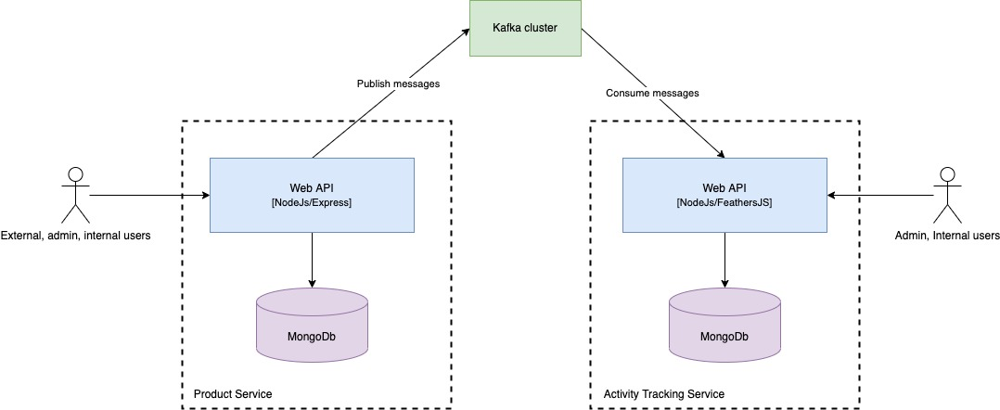
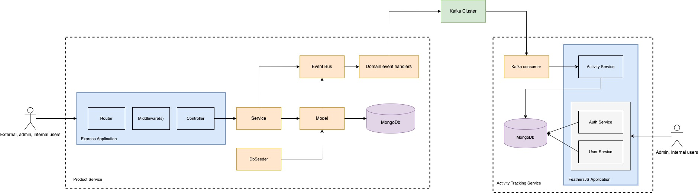
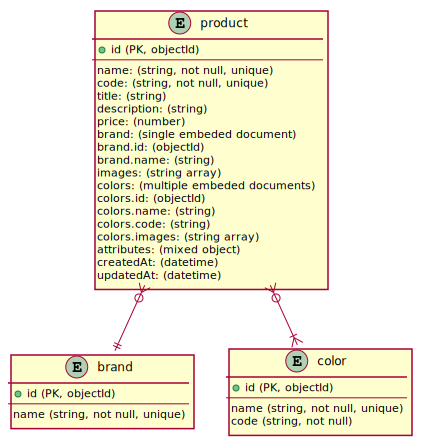
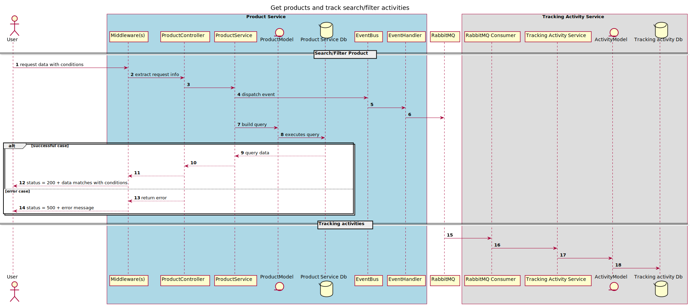

# [NodeJs] Tiny iCommerce

## Requirements:

A small start-up named "iCommerce" wants to build an online shopping application to sell their products. In order
to get to the market quickly, they just want to build a version with a very limited set of functionalities:

- A single web page application that shows all products on which customer can filter, sort and search for
  products based on different criteria such as name, price, branch, color etc.
- A backend side to serve requests from web application such as show products, filter, sort and search.
- If customer finds a product that they like, they can only place order by calling to the company's Call Centre.
- To support sale and marketing, all customers' activities such as searching, filtering and viewing product's
  details need to be stored in the database.
- No customer registration is required.
- No online payment is required.
- You're responsible for designing and implementing the backend services, you don’t need to build the
  frontend web application.

## Business domain boundaries

- Authentication/Authorization for internal enpoint(s)
- Brand management (CRUD)
- Color management (CRUD)
- Product management (CRUD). Note: search/filter and sort in advanced
- Activity tracking (Insert, search/filter and sort in advanced)

## Technical design approach

- Simple and maintainable — so that all levels of engineers can easily catch-up, continue developing, and maintain the system. Furthermore, a simple and reliable system might help us troubleshooting production issues faster and easier. This is the most important concern to build this application.
- Apply some famous principles & design patterns (KISS, SOLID, Singleton, IoC, Builder, Chain Of Responsibility)
- Apply [12factor](https://12factor.net/) methodology.
- Lightweight dependency — reasonable dependency item to adhere to the first principle. The keys of a dependency item/library as below:
  - Stable version (LTS).
  - Popular and good support from the community.
  - Good document or tutorial.
  - Clean and easy to understand.
  - Check for know issues if any before uses it as a dependency.
- Stateless and lightweight application to support scaling on-demand purpose.
- Based on the current requirements, we can apply microservices architecture and separate the system into three services:
  - Product Service
  - Activity Tracking Service
  - Kafka cluster

It could help separate development into multiple isolated scrum development teams with their own business requirements/technical stack and speed up the overall development process.

## Business context overview



## API components



## How to run?

Prerequisites:

- MongoDb. You can setup a MongoDb locally or use a cloud instance. In this example, I will setup a local MongoDb via docker compose.
- Kafka cluster. In this example, I will setup a local Kafka cluster via docker compose.

**Note**: To get MongoDb and a Kafka cluster up and running locally, please make sure docker and docker compose are installed already in your machine.

Run all services with docker compose:

- In the `docker-local-setup` folder:
  - Development mode:
    - `docker-compose -f docker-compose.yml -f docker-compose.dev.yml up`
  - Prodution mode:
    - `docker-compose -f docker-compose.yml -f docker-compose.prod.yml up`

Run indiviual service:

- MongoDb & Kafka cluster:

  - In the `docker-local-setup` folder, run this command:
    - `docker-compose -f db-kafka.yml`

- Product Service:

  - In the `product-service` folder, follow these steps:
    - `npm install`
    - `npm run dev` to run the application in development mode
    - `npm run start` to run the application in production mode
    - `npm run test` to run test

- Tracking Service:
  - In the `tracking-service` folder, follow these steps:
    - `npm install`
    - `npm run dev` to run the application in development mode
    - `npm run start` to run the application in production mode
    - `npm run test` to run test

### Product Service

#### More detail [HERE](product-service/README.md)

#### Database diagram



Example data:

```{
    "_id" : ObjectId("61faa04b1df0d83963fe6257"),
    "name" : "Refined Fresh Sausages",
    "code" : "9VY8EUIPYP",
    "title" : "Refined Fresh Sausages Small Orn, Grimes and Kunze",
    "description" : "Odio dolor repellat molestiae omnis.",
    "price" : 829.43,
    "brand" : {
        "id" : ObjectId("61faa04a1df0d83963fe61db"),
        "name" : "Wiza - Bednar"
    },
    "images" : [
        "http://placeimg.com/640/480/cats",
        "http://placeimg.com/640/480/fashion",
        "http://placeimg.com/640/480/abstract"
    ],
    "colors" : [
        {
            "id" : ObjectId("61faa04a1df0d83963fe61ea"),
            "name" : "sky blue",
            "code" : "#8E9A8B",
            "images" : [
                "http://placeimg.com/640/480/people"
            ],
            "_id" : ObjectId("61faa04b1df0d83963fe6252")
        },
        {
            "id" : ObjectId("61faa04a1df0d83963fe61f6"),
            "name" : "orchid",
            "code" : "#9AA635",
            "images" : [
                "http://placeimg.com/640/480/business",
                "http://placeimg.com/640/480/animals",
                "http://placeimg.com/640/480/cats"
            ],
            "_id" : ObjectId("61faa04b1df0d83963fe6253")
        },
        {
            "id" : ObjectId("61faa04a1df0d83963fe61f8"),
            "name" : "mint green",
            "code" : "#0E465C",
            "images" : [
                "http://placeimg.com/640/480/abstract"
            ],
            "_id" : ObjectId("61faa04b1df0d83963fe6254")
        }
    ],
    "attributes" : [
        {
            "name" : "Has wifi",
            "value" : false
        },
        {
            "name" : "Hot sales",
            "value" : false
        },
        {
            "name" : "Notes",
            "value" : "Debitis consequuntur voluptatem ut aliquam sit explicabo ad rem qui."
        }
    ],
    "createdAt" : ISODate("2022-02-02T15:16:26.990+0000"),
    "updatedAt" : ISODate("2022-02-02T15:16:26.846+0000")
}
```

#### Sample CURL

##### Product

###### GET /products

Sequence diagram:



Basically, the GET /products enable to paginate and search/filter/sort all fields of a product and all fields of its relatives (brand, color). Here are a few sample commands. You can discover further on it.

Example:

`curl -X GET http://localhost:3000/v1/products?name=/car/i&brand.name=Wiza%20-%20Bednar&price>=200&limit=10&page=1&sort=-name \ --header 'Content-Type: application/json'`

=> Get all products with:

- **name** containing 'car' and
- **brand name** equal 'Wiza - Bednar' and
- **price** greater than or equal 200
- then order by **name** descending and
- took top 10 items.

`curl -X GET http://localhost:3000/v1/products?colors.name=pink&price>500&price<=700&limit=10&page=1&sort=-brand.name,name \ --header 'Content-Type: application/json'`

=> Get all products with:

- **color** = 'pink' and
- **price** >= 500 and <= 700
- then order by **brand name** descending and **name** ascending
- took top 10 items.

`curl -X GET http://localhost:3000/v1/products?filter={"$or":[{"colors.name":"yellow"},{"brand.name":"Rath, O'Reilly and Roob"}]}&limit=20&page=1&sort=-name \ --header 'Content-Type: application/json'`

=> Get all products with:

- **color** = 'yellow' **or**
- **brand name** = 'Rath, O'Reilly and Roob'
- then order by **name** descending
- took top 20 items.

More info about the api query params [here](https://www.npmjs.com/package/api-query-params).

##### Brand & Color

Same as product above.

`curl -X GET http://localhost:3000/v1/brands?name=/O'Reilly/i&limit=20&page=1&sort=-name \ --header 'Content-Type: application/json'`

=> Get all brands with:

- **name** contains 'O'Reilly'
- then order by **name** descending
- took top 20 items.

`curl -X GET http://localhost:3000/v1/colors?name=yellow \ --header 'Content-Type: application/json'`

=> Get all colors with:

- **name** = 'yellow'

### Activity Tracking Service

#### More detail [HERE](tracking-service/README.md)

Example data:

```
"_id": "61f67217450fb455323f937b",
"actionType": "Product.GetListWithConditions",
"data": [
    {
      "requestInfo": {
        "corelationId": "aa91a3b1-cd6f-4c26-92da-605516ece2cd",
        "ip": "::1",
        "ips": [],
        "method": "GET",
        "originalUrl": "/v1/products?name=/car/i&price%3E500",
        "userAgent": "Mozilla/5.0 (Macintosh; Intel Mac OS X 10_15_7) AppleWebKit/537.36 (KHTML, like Gecko) Chrome/97.0.4692.99 Safari/537.36",
        "time": "2022-01-30T11:09:54.032Z"
      },
      "filter": {
        "name": "/car/i",
        "price": {
            "$gt": 500
        }
      }
    }
],
"createdAt": "2022-01-30T11:10:15.635Z",
"updatedAt": "2022-01-30T11:10:15.635Z"
```

`curl -X GET http://localhost:3030/v1/activities?actionType=Product.GetListWithConditions \ --header 'Content-Type: application/json'`

=> Get activities with:

- actionType = 'Product.GetListWithConditions'
- default limit = 10
- default page = 1
- default sort = createdAt

`curl -X GET http://localhost:3030/v1/activities?data.requestInfo.corelationId=aa91a3b1-cd6f-4c26-92da-605516ece2cd \ --header 'Content-Type: application/json'`

=> Get activities with:

- accorelationId = 'aa91a3b1-cd6f-4c26-92da-605516ece2cd'
- default limit = 10
- default page = 1
- default sort = createdAt

### Points to discuss

- Kafka or RabbitMQ?
- Service discovery at application level or infrastructure level?
- DI container or not?
- MongoDb - Embeded document or reference document
